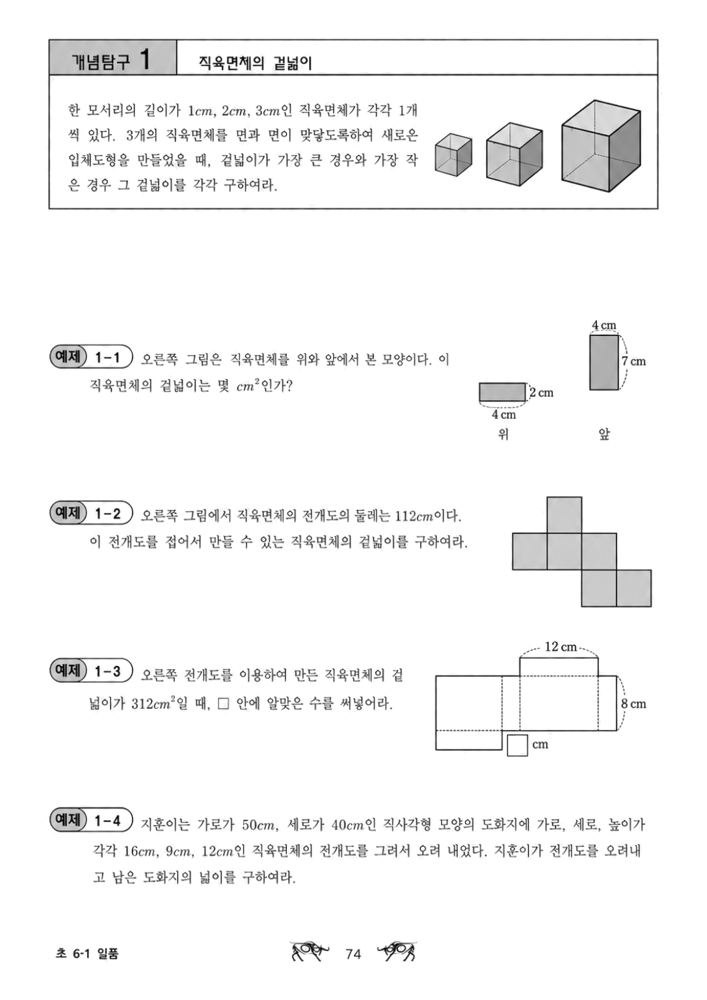
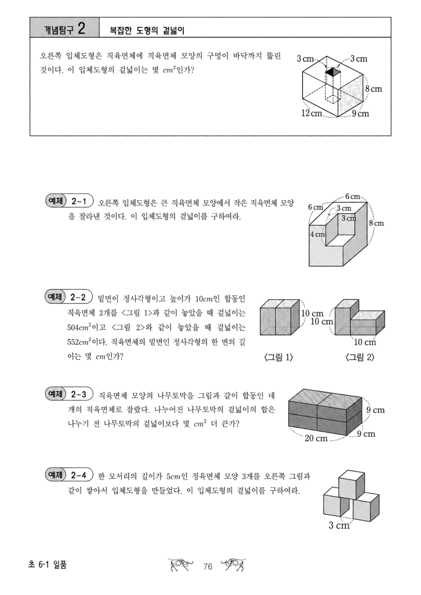
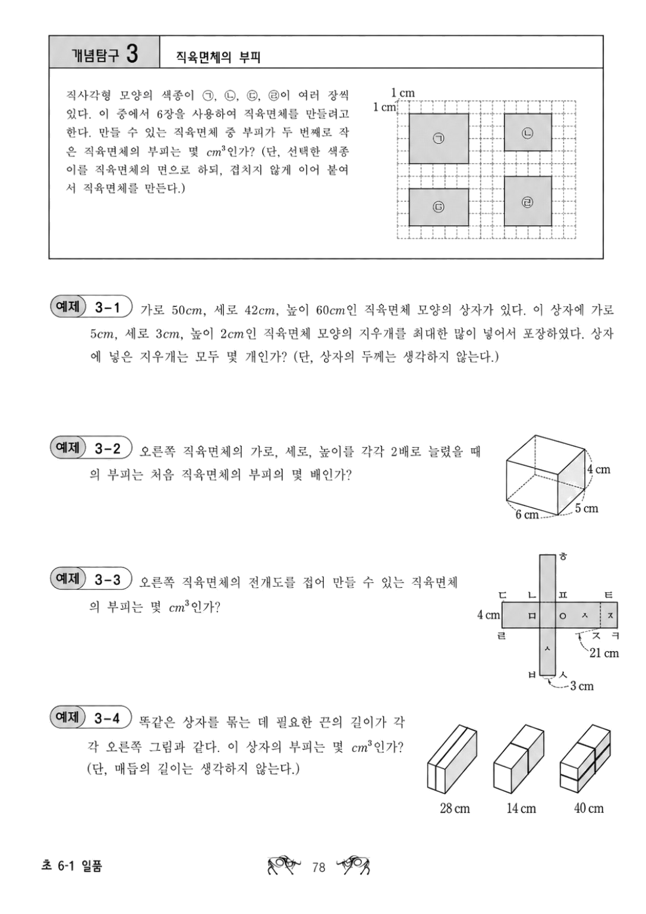
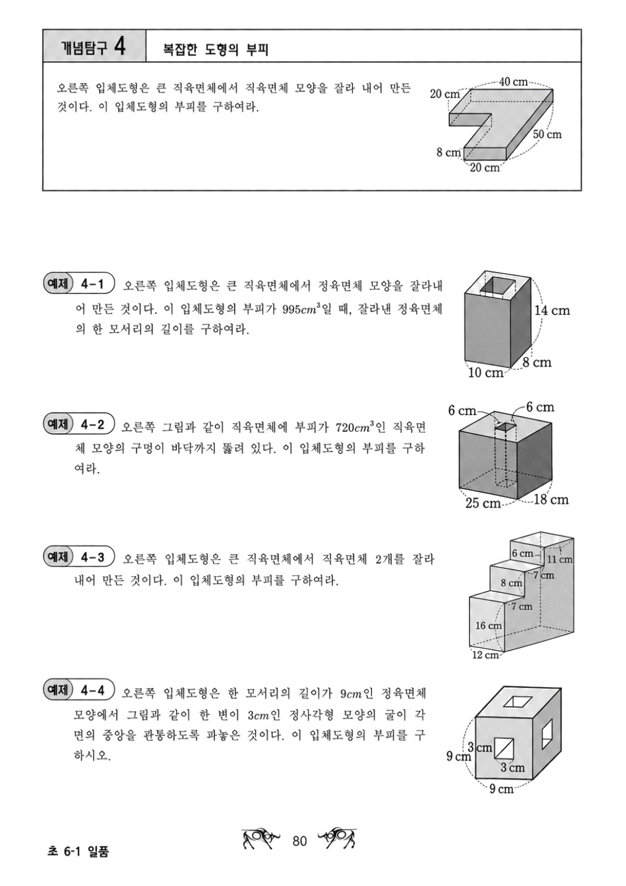
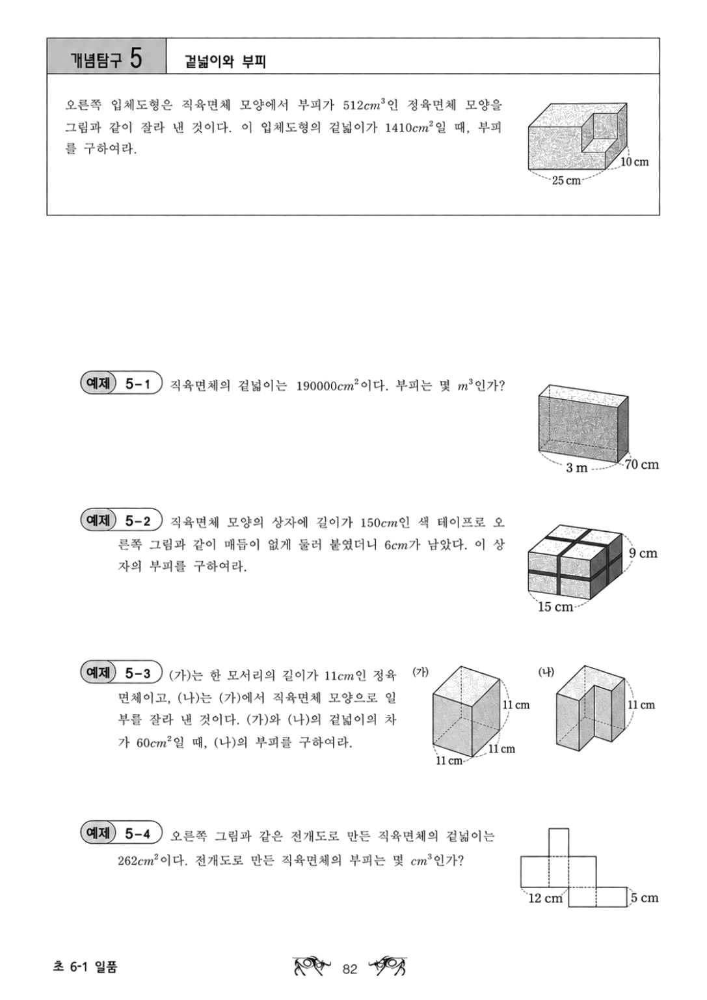
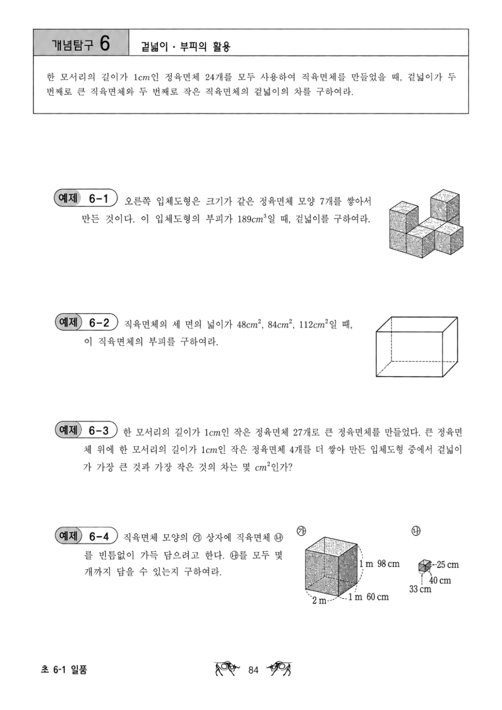
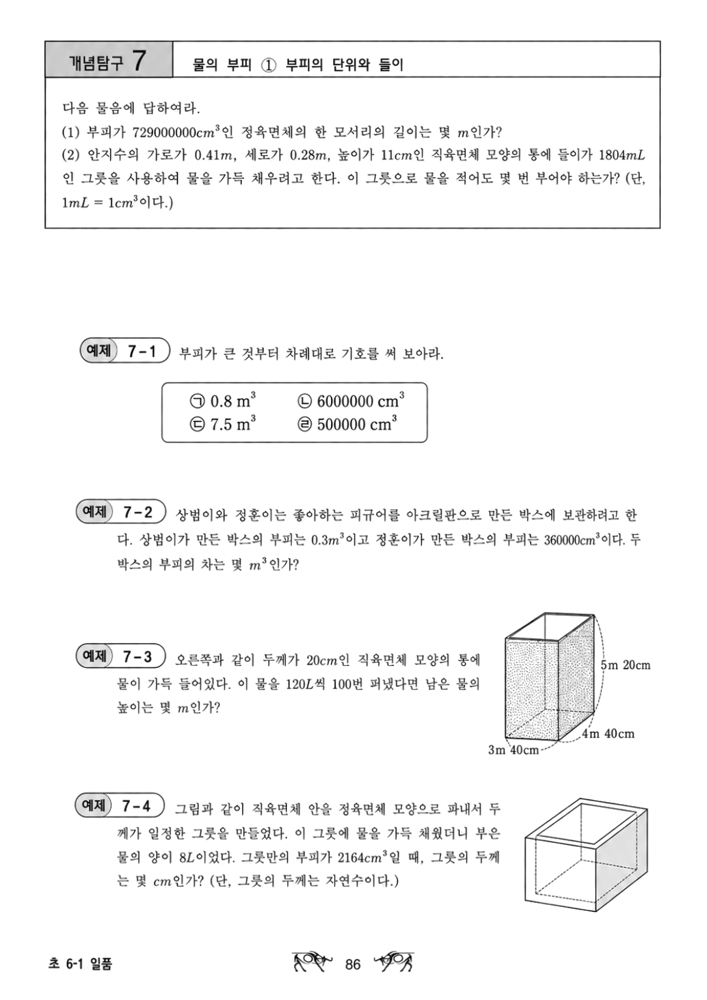
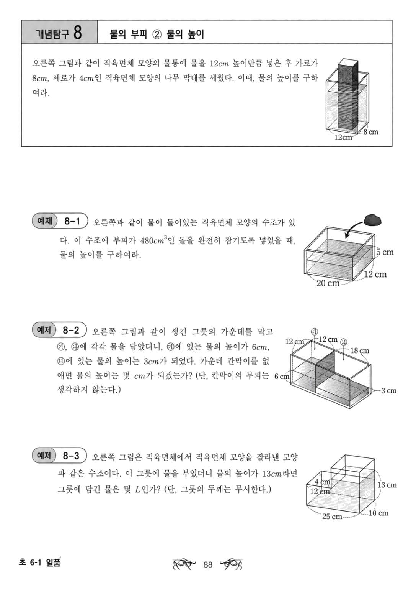
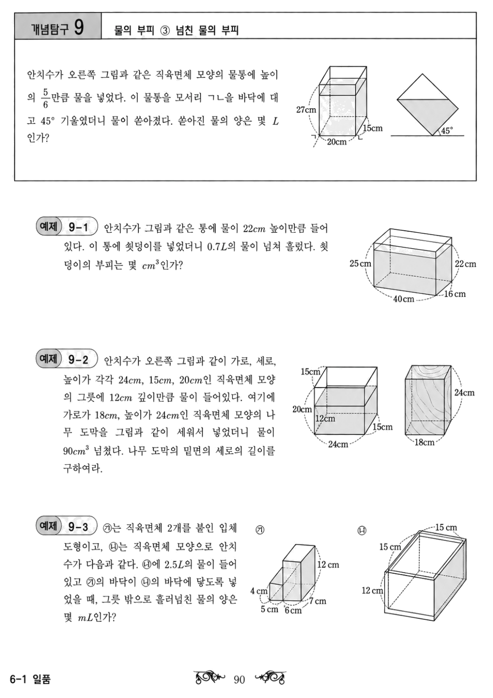
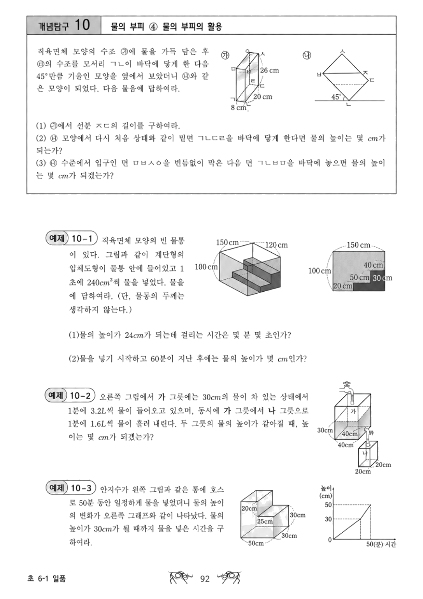

# 초 6-1 일품 도형과 부피

개념탐구 1~10 전체 페이지를 앱 문제집 형식에 맞춘 자료입니다.
문제 본문은 OCR로 다시 입력하지 않고 원본 페이지 이미지를 그대로 사용합니다.

## 개념탐구 1 직육면체의 겉넓이

## 개념탐구 2 복잡한 도형의 겉넓이

## 개념탐구 3 직육면체의 부피

## 개념탐구 4 복잡한 도형의 부피

## 개념탐구 5 겉넓이와 부피

## 개념탐구 6 겉넓이·부피의 활용

## 개념탐구 7 물의 부피 ① 부피의 단위와 들이

## 개념탐구 8 물의 부피 ② 물의 높이

## 개념탐구 9 물의 부피 ③ 넘친 물의 부피

## 개념탐구 10 물의 부피 ④ 물의 부피의 활용

